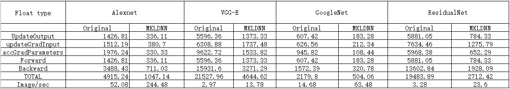

# Torch-MKLDNN-benchmark

To run the original performance, use: th benchmark_nn.lua

To run the Torch+MKLDNN performance, use: ./run.sh or th benchmark_mkldnn.lua

Performance of Torch+MKLDNN compared with original torch is as follows:

##Environment:

Hardware: 2 * Intel(R) Xeon(R) CPU E5-2699 v4 @ 2.20GHz, 128G RAM

Software:Ubuntu 14.04.4, MKL 2017beta.

## Performance

The performance is the time(ms):

