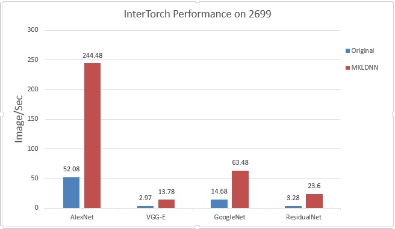

# IntelTorch-benchmark

To run the original Torch performance, use: th benchmark_nn.lua

To run the IntelTorch performance, use: ./run.sh or th benchmark_mkldnn.lua

Compared to the original Torch, Intel Torch gets 4.66x speedup.The performance is as follows:

##Environment:

Hardware: 2 * Intel(R) Xeon(R) CPU E5-2699 v4 @ 2.20GHz, 128G RAM

Software:Ubuntu 14.04.4, MKL 2017beta.

## Performance

